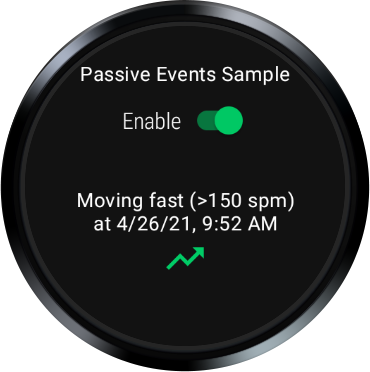
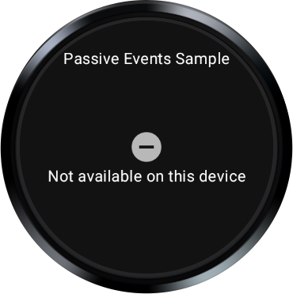

# Passive Events Sample

This sample demonstrates receiving passive event notifications in the background using the
`PassiveMonitoringClient` API.

### Running the sample

You will need a Wear device with Health Services installed.

- Open the sample project in Android Studio.
- Plug in your Wear device and launch the app.

On startup, the app checks whether steps per minute data is available. If it is, you will see a
screen like this:



Use the switch to enable or disable event subscriptions. The most recent event received is shown
below that.

On devices where steps per minute is not available, you will see a screen like this:



### Show synthetic data

With the sample running, you can turn on the sythetic data tracker by running the below command from
a shell. This will mimic the user performing an activity and generating steps data. Check the app UI
or logcat messages to see these data updates.

```shell
adb shell am broadcast \
-a "com.google.android.wearable.healthservices.tracker.defaultmanager.providers.synthetic.USE_SYNTHETIC_TRACKER" \
com.google.android.wearable.healthservices
```

To trigger the event when steps per minute exceeds 150, simulate the user is running:
```shell
# running
adb shell am broadcast \
-a "com.google.android.wearable.healthservices.tracker.defaultmanager.providers.synthetic.user.START_RUNNING" \
com.google.android.wearable.healthservices
```

To trigger the event when steps per minute falls below 60, simulate an exercise with low speed:
```shell
# running
adb shell am broadcast \
-a "com.google.android.wearable.healthservices.tracker.defaultmanager.providers.synthetic.user.START_EXERCISE" \
--ef activity_options_average_speed 1.0 \
com.google.android.wearable.healthservices
```

To stop using the synthetic tracker, run this command:
```shell
adb shell am broadcast -a \
"com.google.android.wearable.healthservices.tracker.defaultmanager.providers.synthetic.USE_SENSORS_TRACKER" \
com.google.android.wearable.healthservices
```
