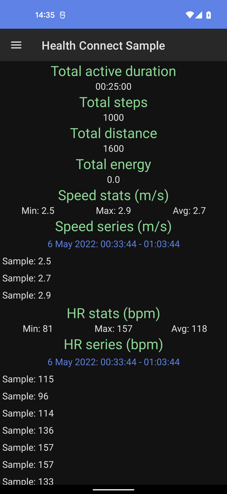
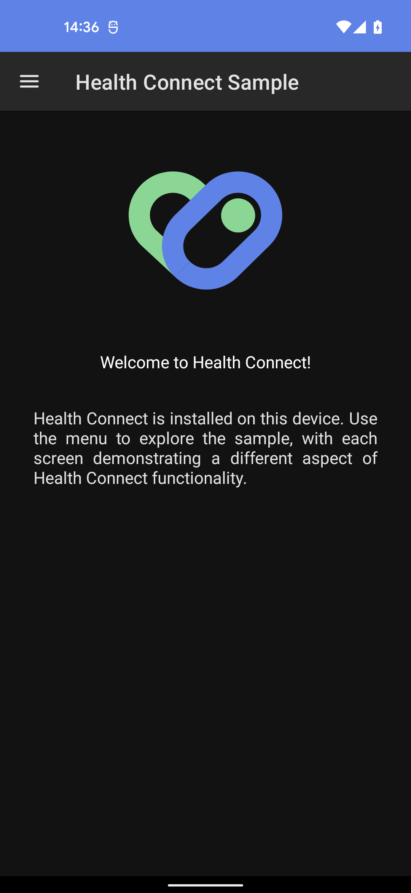
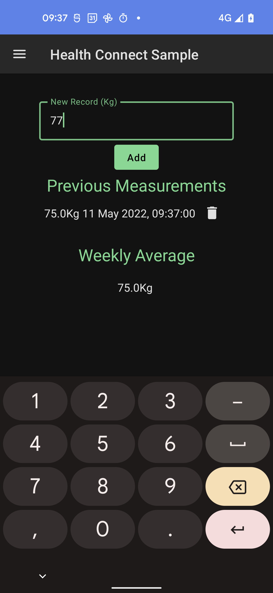

# Health Connect Sample

This repository contains a sample to help you get started writing [Health Connect][health-connect] apps for Android.

## Setup

You will need:

*   An Android device or emulator running API level 27 or greater
*   The [Health Connect APK][health-connect-apk] installed on the device or emulator

## Screenshots

  

## Getting started

This sample uses the Gradle build system. To build this project, use the "gradlew build" command or "File > Open" in Android Studio.

## Support

If you've found an error in this sample, please file an issue:
https://github.com/android/health-samples

Patches are encouraged, and may be submitted by forking this project and
submitting a pull request through GitHub. Please see [CONTRIBUTING][contributing] for more details.

[health-connect]: https://developer.android.com/health-connect
[health-connect-apk]: https://play.google.com/store/apps/details?id=com.google.android.apps.healthdata
[contributing]: ../../CONTRIBUTING.md
