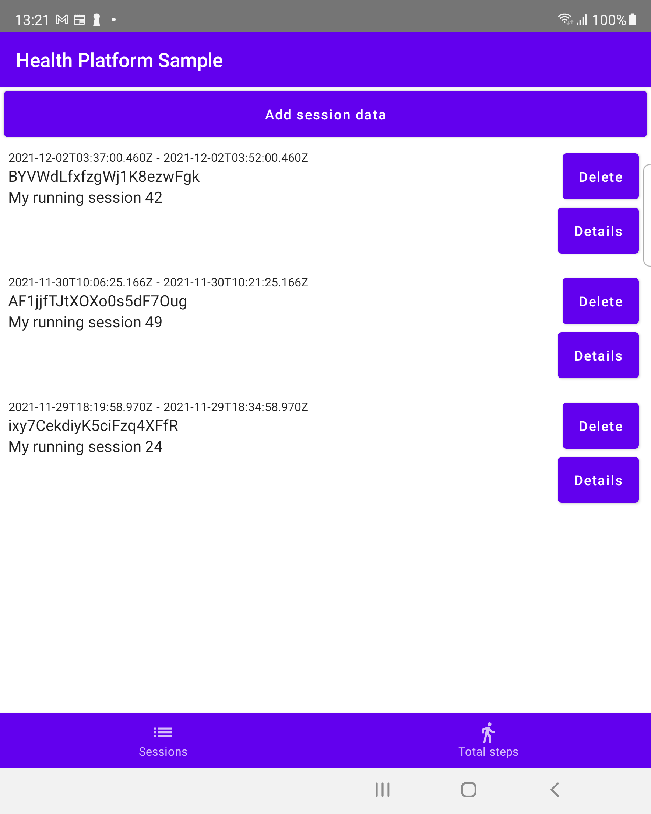

# Health Platform Sample

This sample demonstrates inserting and reading out historic fitness & health
records using the `HealthDataClient` API.

### Prerequisites

You will need a Samsung device operating on Oreo or above with Samsung Health
Platform installed: At this time the Health Platform is only available on
Samsung devices.

### Running the sample

Open the sample project in Android Studio and launch the app
on your device.

### Add session data

Pressing the button will attempt to generate some dummy data and insert into
Health Platform, and optionally present permission grants to the user if needed.
Inserted session is visible to any other clients granted with corresponding
`READ` permission in Health Platform, for example Samsung Health.

### Show session data

Pressing the button will attempt to present available activity sessions in the
Health Platform, and optionally present permission grants to the user if needed. A
list of sessions with titles and timestamps are present, with option to delete
or view session associated metrics, such as distance, calories, heart rate.

### Show total steps

Pressing the button will query total weekly steps available in the Health
Platform.
