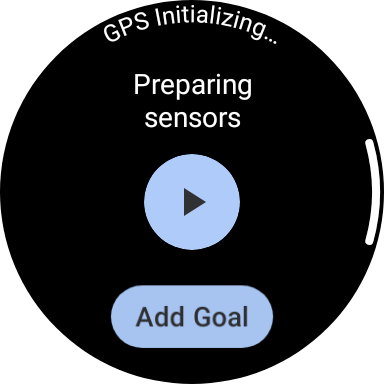
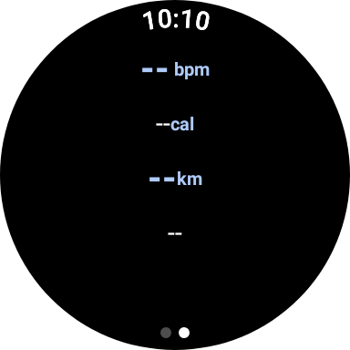

# Exercise Sample

This sample demonstrates managing an exercise experience using the `ExerciseClient` API.

### Running the sample

You will need a Wear device or emulator with Health Services installed. Open the sample project in
Android Studio and launch the app on your device or emulator.

On startup, the app checks the device capabilities. If the necessary exercise capabilities are
available, you will see a screen like this:

When you press start, the app configures a running exercise and starts it. (You may need to use the
[synthetic data provider](#using-synthetic-data) so that Health Services doesn't immediately pause
the exercise due to no user activity.) While the exercise is active, the UI will show the exercise
duration, heart rate bpm, calories burned, distance traveled, and the number of laps. 

While an exercise is in progress, if you leave the app, an ongoing notification appears, offering
quick return to the exercise screen.

On devices where the exercise capability is not available, you will see a screen like this:

