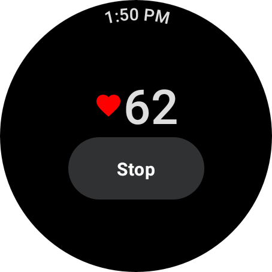
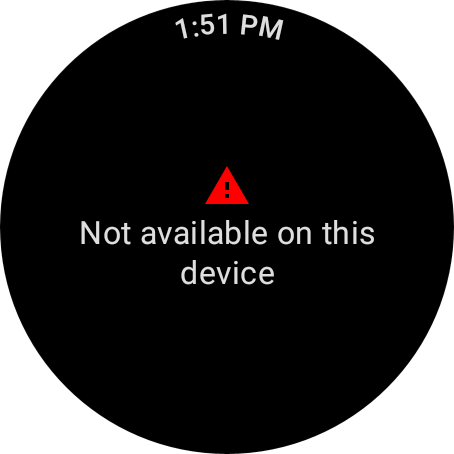

# Measure Data Sample (Compose)

This sample demonstrates receiving rapid data updates in the foreground using the `MeasureClient`
API.

### Running the sample

You will need a Wear device or emulator with Health Services installed. Open the sample project in
Android Studio and launch the app on your device or emulator.

On startup, the app checks whether heart rate data is available. If it is, you will see a screen
like this:



On devices where heart rate data is not available, you will see a screen like this:



### Try it with synthetic data

With the sample running, you can turn on the synthetic data provider by running the below command
from a shell. This will mimic the user performing an activity and generating heart rate data. Check
the app UI or logcat messages to see these data updates.

```shell
adb shell am broadcast \
-a "whs.USE_SYNTHETIC_PROVIDERS" \
com.google.android.wearable.healthservices
```

To see different heart rate values, try simulating different exercises:
```shell
# walking
adb shell am broadcast \
-a "whs.synthetic.user.START_WALKING" \
com.google.android.wearable.healthservices

# running
adb shell am broadcast \
-a "whs.synthetic.user.START_RUNNING" \
com.google.android.wearable.healthservices
```

To stop using the synthetic provider, run this command:
```shell
adb shell am broadcast -a \
"whs.USE_SENSOR_PROVIDERS" \
com.google.android.wearable.healthservices
```
