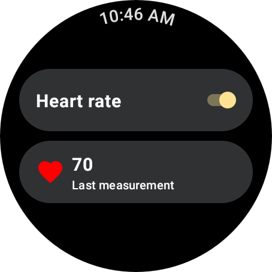
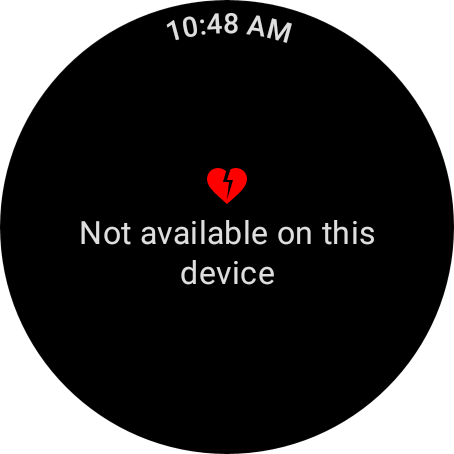

# Passive Data Sample (Compose)

This sample demonstrates receiving passive data updates in the background using the
`PassiveMonitoringClient` API.

### Running the sample

You will need a Wear device or emulator with Health Services installed. Open the sample project in
Android Studio and launch the app on your device or emulator.

On startup, the app checks whether heart rate data is available. If it is, you will see a screen
like this:



Use the switch to enable or disable passive data updates. The most recent measurement received is
shown below that.

Note that on some devices, it may take several minutes for a value to be returned and displayed.

On devices where heart rate data is not available, you will see a screen like this:



### Try it with synthetic data

With the sample running on an emulator running Wear OS 4 or higher, the emulator will automatically
generate synthetic data. Check the app UI or logcat messages to see these data updates.

To use synthetic data on emulators or physical devices running Wear OS 3,
consult [the documentation](https://developer.android.com/health-and-fitness/guides/health-services/simulated-data#use_synthetic_data_on_wear_os_3)
for synthetic data commands.

## Troubleshooting

### App crashes with `java.lang.Exception: Not yet implemented`

This crash has been seen when using the Wear Emulator, in the scenario where the Health Services version on the emulator is extremely old:

```
E/AndroidRuntime: FATAL EXCEPTION: main
    Process: com.example.passivedatacompose, PID: 30333
        java.lang.Exception: Not yet implemented
            at androidx.health.services.client.impl.internal.StatusCallback.onFailure(StatusCallback.kt:42)  
```

To resolve this issue, ensure you are using the [latest Wear image in your emulator](https://developer.android.com/studio/intro/update)

You can verify the version of Health Services using:

```
adb shell dumpsys package com.google.android.wearable.healthservices | grep versionCode
```

Ensure that this value is at least `70695`.