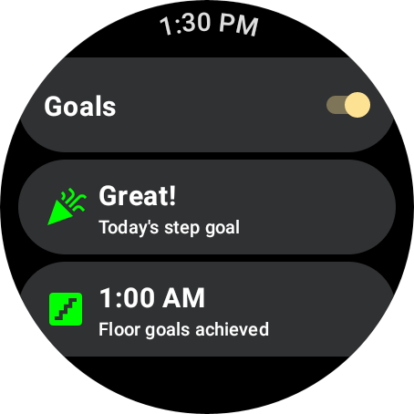
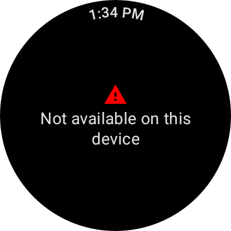

# Passive Goals Sample (Compose)

This sample demonstrates receiving passive goal notifications in the background using the
`PassiveMonitoringClient` API.

### Running the sample

You will need a Wear device with Health Services installed.

- Open the sample project in Android Studio.
- Plug in your Wear device and launch the app.

On startup, the app checks whether steps and floors data is available. If it is, you will see a
screen like this:



Use the switch to enable or disable goal subscriptions. Two separate goals are configured:

- Daily step goal: Notification for achieving 10,000 steps. This resets each day
- Floors goal: This goal notifies the user each time 3 floors have been climbed

On devices where steps and floors are not available, you will see a screen like this:



### Show synthetic data

With the sample running on an emulator running Wear OS 4 or higher, the emulator will automatically
generate synthetic data. Check the app UI or logcat messages to see these data updates.

To use synthetic data on emulators or physical devices running Wear OS 3,
consult [the documentation](https://developer.android.com/health-and-fitness/guides/health-services/simulated-data#use_synthetic_data_on_wear_os_3)
for synthetic data commands.

## Troubleshooting

### App crashes with `java.lang.Exception: Not yet implemented`

This crash has been seen when using the Wear Emulator, in the scenario where the Health Services version on the emulator is extremely old:

```
E/AndroidRuntime: FATAL EXCEPTION: main
    Process: com.example.passivegoalscompose, PID: 30333
        java.lang.Exception: Not yet implemented
            at androidx.health.services.client.impl.internal.StatusCallback.onFailure(StatusCallback.kt:42)  
```

To resolve this issue, ensure you are using the [latest Wear image in your emulator](https://developer.android.com/studio/intro/update)

You can verify the version of Health Services using:

```
adb shell dumpsys package com.google.android.wearable.healthservices | grep versionCode
```

Ensure that this value is at least `70695`.