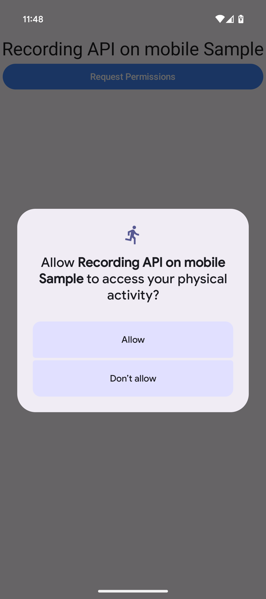
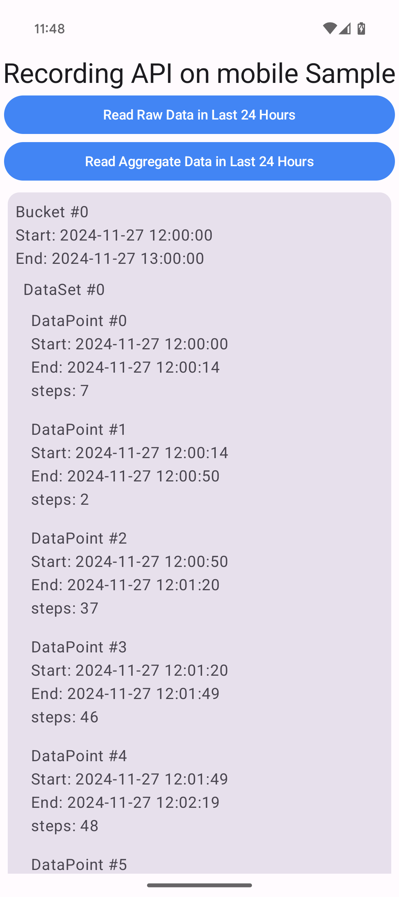
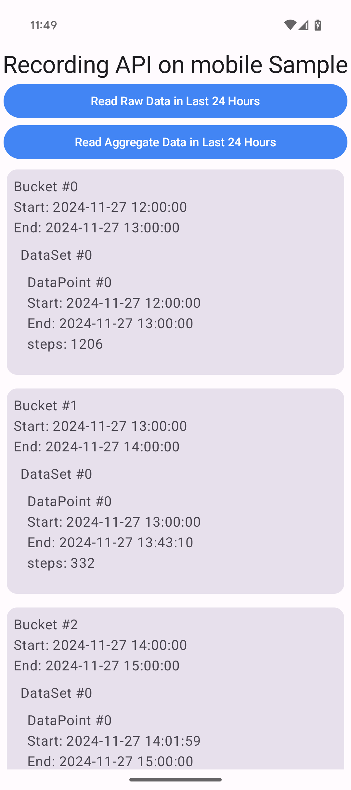

# Recording API on mobile Sample

This repository contains a sample to help you get started writing [Recording API on mobile][recording-api] apps for Android.

## Screenshots

  

## Getting started

This sample uses the Gradle build system. To build this project, use the "gradlew build" command or "File > Open" in Android Studio.

## Support

If you've found an error in this sample, please file an issue:
https://github.com/android/health-samples

Patches are encouraged, and may be submitted by forking this project and
submitting a pull request through GitHub. Please see [CONTRIBUTING][contributing] for more details.

[recording-api]: https://developer.android.com/health-and-fitness/guides/recording-api
[contributing]: ../../CONTRIBUTING.md